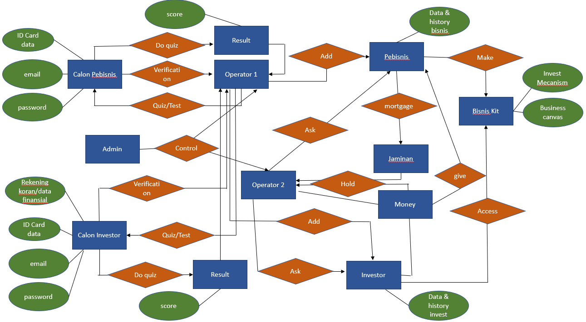
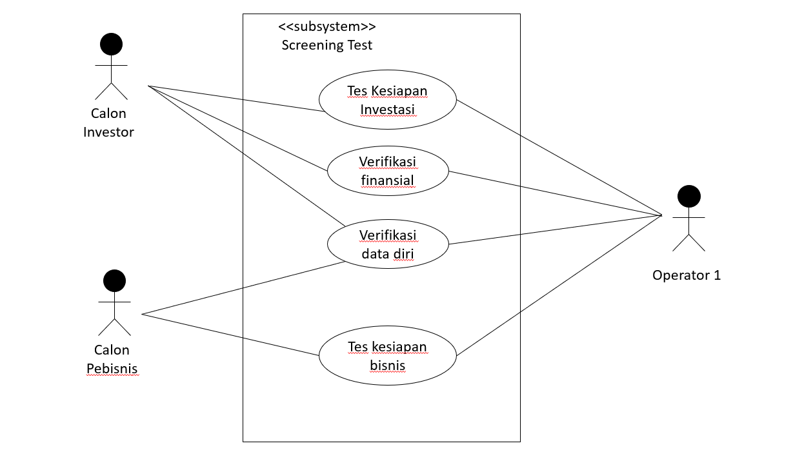
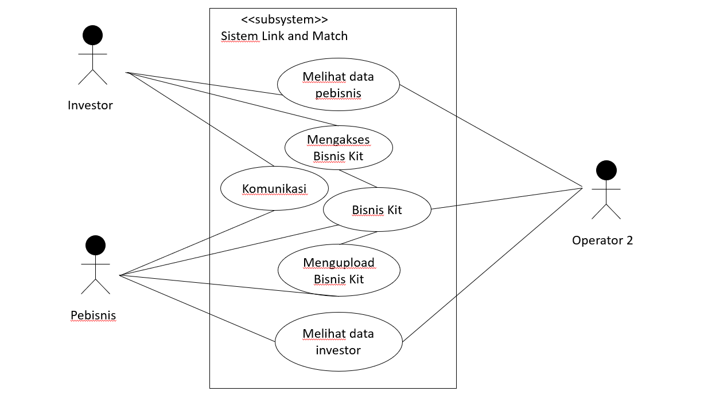
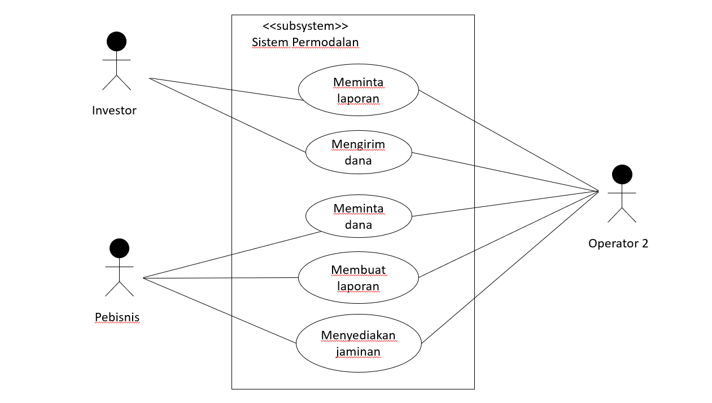

## Sistem Social Entrepreneur Link and Match Usaha Kecil dengan Investor

Usaha kecil mungkin termasuk dalam bisnis yang bersifat situasional, yang jika mendapatkan metode dan sumberdaya yang tepat, bisa berjalan berkelanjutan dan bahkan dapat berkembang menjadi usaha kecil menengah dan lain sebagainya. Kendala dalam mencari dan membuka jaringan, serta kurangnya ilmu dan pengalaman menjadi dinding pembatas dalam usaha jenis ini. Di sisi lain, beberapa orang yang memiliki taraf ekonomi menengah ke atas mungkin ragu untuk menginvestasikan hartanya di usaha jenis ini karena lemahnya fungsi pendampingan, pengawasan, dan lain sebagainya padahal memiliki keinginan yang bukan hanya ingin memberi, tapi juga bisa  melihat adanya perkembangan. Sistem ini hadir sebagai solusi untuk menyediakan ilmu dan pendampingan pada pihak yang ingin membuka usaha dan membuka akses jaringan, sementara di sisi lain memberikan opsi investasi lain kepada para investor yang berniat membantu pihak lain yang telah dinyatakan layak oleh system dengan tetap mendapatkan informasi terbaru tentang pihak yang menerima bantuan.

Terdapat beberapa fitur system yang bisa digunakan oleh beberapa entitas, di antaranya:
1.	Bagi calon pengusaha : verifikasi data diri, kuis/tes kesiapan bisnis
2.	Bagi pengusaha siap bisnis: bisnis inkubasi
3.	Bagi operator sistem: melaporkan dan menghubungkan antar pihak
4.	Bagi admin: memverifikasi data dan mengevaluasi operasi
5.	Bagi calon investor: verifikasi data diri terutama finansial, kuis/tes kesiapan investasi
6.	Bagi investor siap investasi: memantau dan mengevaluasi aktivitas usaha

Gambar 1.  Entity relationship diagram 

Gambar di atas menunjukan tentang alur data dan informasi serta hak-hak akses antar entitas. Entitas admin berfungsi sebagai entitas utama yang dapat menjalankan dan mengevaluasi system. Calon investor dan calon pengusaha termasuk dalam kategori entitas yang lemah karena memiliki aktivitas yang terbatas dibanding dengan entitas lainnya.

Gambar 2. Use case diagram selection quiz/test

Gambar di atas merupakan salah satu unified modelling language (UML) berupa use case diagram (UCD) yang menunjukan aktivitas antar pihak dalam sistem, calon pebisnis dan calon investor hanya bisa melakukan aktivitas ini (akses terbatas) sehingga belum bisa mengakses lebih dalam fitur-fitur yang tersedia dalam sistem.

Gambar 3. Use case diagram sistem view and chat subsistem link and match

Gambar di atas merupakan salah satu unified modelling language (UML) berupa use case diagram yang menunjukan aktivitas antar pihak dalam sistem, pebisnis  investor bisa melakukan chat melalui fitur yang tersedia dan bisa melihat list investor dan list pebisnis yang ada berdasarkan pencarian, kemudian mengakses detail berupa bisnis kit yang bisa berisi bisnis canvas, studi kelayakan bisnis, serta mekanisme kesepakatan.

Gambar 4. Use case diagram sistem investasi, monitoring dan evaluasi

Gambar di atas menunjukan bahwa akses dana dapat dikategorikan sebagai aliran terbatas karena hanya bisa diakses melalui operator sebagai pihak ketiga untuk menghindari adanya kemungkinan penipuan. Sistem laporan juga dibuat dengan aliran terbatas agar antara pebisnis dan investor tidak saling mengintervensi kesepakatan yang telah dibuat sebelumnya untuk menghindari aktivitas dominasi satu sama lain.
Berdasarkan ERD dan UML berupa UCD yang telah dibuat, terdapat beberapa tampilan yang berbeda antar pengguna aplikasi seperti di bawah ini.
1.	Calon pebisnis
-	Sign up
-	Verification email, password, and ID
-	Sign in
-	Read about test handbook
-	Test 
-	Test result
-	Report problem
2.	Calon investor
-	Sign up
-	Verification email, password, and ID
-	Sign in
-	Register financial condition
-	Verification financial condition
-	Read about test handbook
-	Test
-	Test result
-	Report problem
3.	Pebisnis
-	Sign up business
-	Get/download Business Kit handbook
-	Upload Business Kit
-	View, search, and chat other business account
-	View, search, and chat investor account
-	Get deal from investor through operator
-	Register account transfer etc
-	Report problem
-	Upload business progress
-	Finish the cooperation with approval from operator
4.	Investor
-	Sign up investation offer
-	Get/download Investaion handbook
-	Upload investation offer
-	View, search, and chat other investor account
-	View, search, and chat business account
-	Set deal for business through operator
-	Report problem
-	Transfer money to operator
-	Download business progress
-	Finish the cooperation with approval from operator
5.	Operator
-	Sign in
-	Add business account candidate
-	Add investor candidate
-	Get verification business account candidate
-	Get verification investor account candidate
-	Send quiz/test to business account candidate
-	Send quiz/test to investor account candidate
-	Get Result test
-	Add business account
-	Add investor account
-	Get deal from investor account
-	Set deal for business account
-	Get money transfer from investor account
-	Send money to business account
-	Ask daily/weekly report from business account
-	Send daily/weekly report to investor account
-	Ask monitoring and evaluation from investor account
-	Send monitorting and evaluation result to business account
-	End deal/agreement between business and investor account
-	Send report to admin
6.	Admin
-	Get report from operator
-	Get report from business account candidate
-	Get report from investor account candidate
-	Get report from business account
-	Get report from investor account
-	Delete business account candidate
-	Delete investor account candidate
-	Delete business account
-	Delete investor account
-	Edit business account candidate
-	Edit investor account candidate
-	Edit business account
-	Edit investor account

